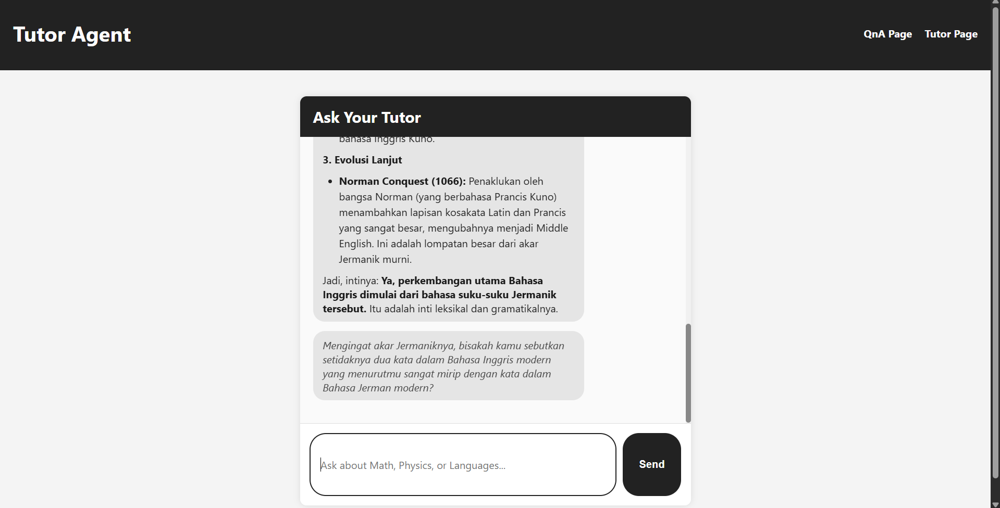
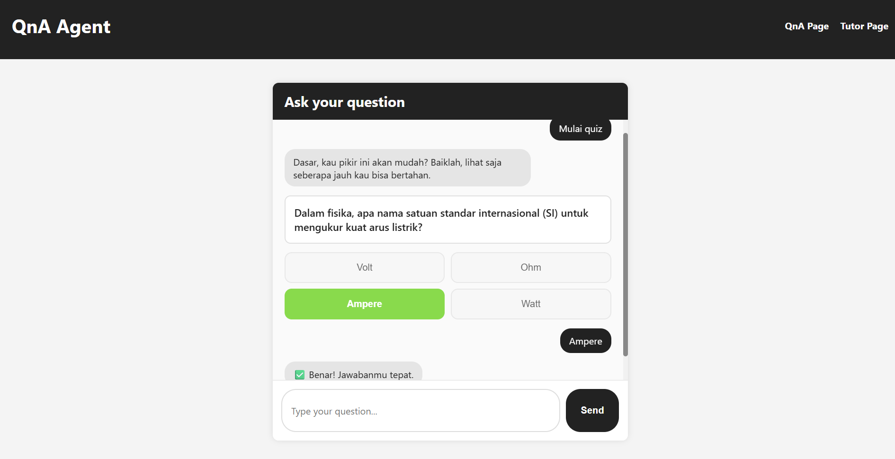

# AI-Powered Learning Platform

An interactive educational platform that combines AI-driven tutoring and adaptive quiz systems to enhance student learning outcomes across multiple subjects.

## Overview

This platform provides students with two complementary learning modes: an interactive Q&A system for self-assessment and an intelligent tutoring system for concept mastery. The system leverages AI to deliver personalized educational experiences tailored to individual learning needs.

## Features

### 1. Q&A Quiz System
An adaptive assessment module that evaluates student understanding through interactive multiple-choice questions.

**Key Capabilities:**
- Dynamic question generation based on student queries
- Real-time answer validation with immediate feedback
- Visual feedback system (correct/incorrect indicators)
- Progressive difficulty adjustment
- Session-based learning tracking

**Learning Benefits:**
- Immediate knowledge assessment
- Reduced test anxiety through interactive format
- Clear visual cues for learning reinforcement
- Engagement through gamified elements

### 2. Intelligent Tutoring Agent
A conversational AI tutor that provides detailed explanations and guided learning across Mathematics, Physics, and Languages.

**Key Capabilities:**
- Subject-specific expertise (Math, Physics, Languages)
- Structured explanations with supporting examples
- Follow-up questioning to ensure comprehension
- Formatted content delivery (lists, emphasis, hierarchy)
- Contextual learning paths

**Learning Benefits:**
- Personalized one-on-one instruction
- Available 24/7 without scheduling constraints
- Patient, judgment-free learning environment
- Adaptive explanations based on student responses

## Technical Architecture

The following architectural overview illustrates the interaction between the frontend, the n8n workflow engine, the agentic reasoning layer, and the AI model. It provides a high-level representation of how user inputs travel through orchestrated decision pathways before being transformed into structured educational feedback.

### Frontend
- **Interface**: Clean, responsive web interface optimized for learning

- **Design Philosophy**: Duolingo-inspired minimalist UI for reduced cognitive load

  
- **Accessibility**: Clear visual hierarchy and intuitive navigation

### Backend Integration
- **AI Processing**: Webhook-based communication with AI agents
  - The platform employs an agentic AI structure that moves beyond single-turn text generation and enables the system to operate through a deliberate sequence of planning, reasoning, and task execution steps. This configuration allows the tutor to interpret user intent, decide when to invoke specific workflows, request clarifications when necessary, and generate structured guidance in a manner that resembles purposeful problem solving. The agent loop ensures that explanations, answer validations, and follow-up prompts are produced through a controlled reasoning process rather than ad-hoc model responses, making the interaction more stable and pedagogically consistent. 
- **Session Management**: UUID-based session tracking for continuity
  - All backend orchestration is coordinated through n8n, which functions as the central workflow engine linking the frontend interface, the agentic layer, and the AI model. The workflow automates request routing, enforces branching logic between the quiz mode and tutoring mode, validates incoming payloads, and regulates error pathways so that degraded responses remain interpretable. By externalizing these control flows into n8n, the system gains operational transparency and becomes easier to maintain, extend, and monitor, especially as additional learning modes or analytic components are introduced.
- **Response Parsing**: Intelligent JSON parsing and formatting
- **Error Handling**: Graceful degradation with fallback responses

### User Experience
- **Input Flexibility**: Support for both text input and option selection
- **Visual Feedback**: Color-coded responses (green for correct, red for incorrect)
- **Content Formatting**: Markdown-style formatting for enhanced readability
- **Responsive Design**: Consistent experience across devices

## Use Cases

### For Students
- **Self-Study**: Review concepts independently at your own pace
- **Exam Preparation**: Test knowledge through adaptive quizzes
- **Homework Support**: Get step-by-step explanations for difficult topics
- **Concept Clarification**: Ask follow-up questions until fully understood

### For Educators
- **Supplementary Tool**: Complement classroom instruction with AI-powered practice
- **Learning Analytics**: Track student engagement through session data
- **Scalable Support**: Provide consistent support outside classroom hours
- **Differentiated Learning**: Allow students to progress at individual rates

## Getting Started

### Prerequisites
- Modern web browser (Chrome, Firefox, Safari, Edge)
- Internet connection for AI backend communication

### Installation
1. Clone or download the project files
2. Ensure all files are in the same directory:
   - `index.html` (Q&A page)
   - `tutor.html` (Tutor page)
   - `styles.css` (shared styling)
   - `qna.js` (Q&A logic)
   - `tutor.js` (Tutor logic)
3. Open `index.html` or `tutor.html` in your browser

### Navigation
- Use the header navigation to switch between Q&A and Tutor modes
- Each mode maintains separate conversation sessions
- Sessions persist until page refresh

## Educational Philosophy

This platform is built on evidence-based learning principles:

1. **Active Learning**: Students engage directly with content rather than passive consumption
2. **Immediate Feedback**: Real-time validation reinforces correct understanding
3. **Mastery-Based Progression**: Students can revisit concepts until confident
4. **Low-Stakes Assessment**: Reduces anxiety through private, judgment-free practice
5. **Metacognitive Development**: Encourages self-assessment and reflection

## Privacy & Data

- **Session Isolation**: Each learning session uses a unique identifier
- **No Personal Data**: System does not collect or store personal information
- **Ephemeral Sessions**: Session data resets on page refresh
- **Secure Communication**: All data transmitted via HTTPS webhooks

## Future Enhancements

Planned features for upcoming releases:
- Multi-language support for global accessibility
- Progress tracking and performance analytics
- Spaced repetition algorithms for long-term retention
- LaTeX rendering for advanced mathematical notation
- Voice interaction capabilities
- Collaborative learning modes

## Support

For technical issues or educational inquiries, students and educators can:
- Review the in-app guidance text
- Check browser console for debugging information
- Ensure stable internet connectivity
- Refresh the page to reset sessions if needed

## License

This project is designed for educational purposes.

---

**Version**: 1.0  
**Last Updated**: December 2025  
**Platform Type**: Web-based Learning Application  
**Target Audience**: Secondary and Higher Education Students
